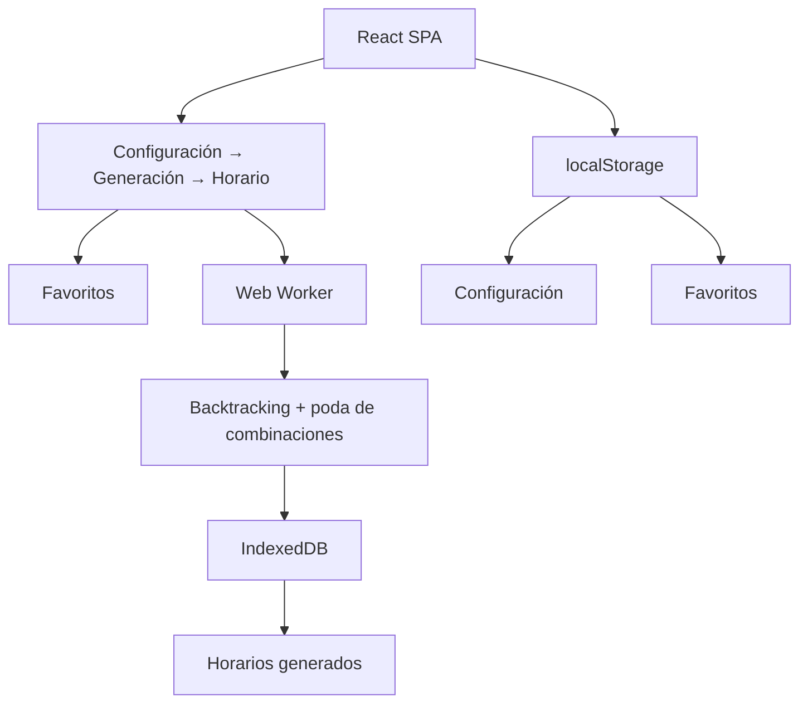
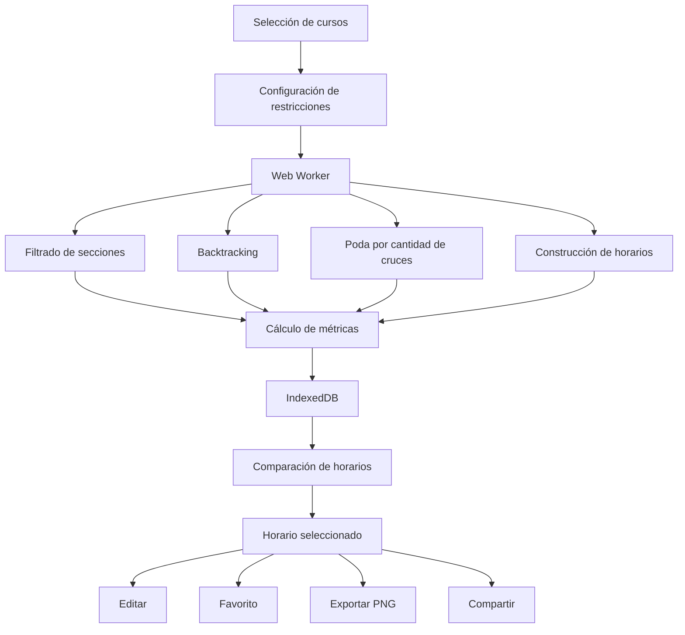
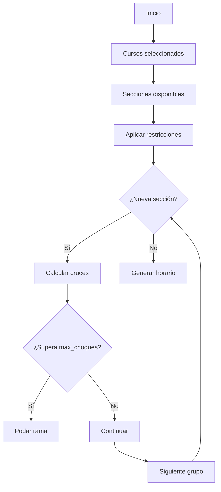

# 🎓 Optimizador de Horarios Universitario

[](https://vitejs.dev/)
[](https://react.dev/)
[](https://www.typescriptlang.org/)
[](https://tailwindcss.com/)
[](https://developer.mozilla.org/en-US/docs/Web/Progressive_web_apps)
[](https://vercel.com/)

Aplicación web progresiva para la **generación y optimización de horarios universitarios**, diseñada para ayudar a estudiantes a explorar automáticamente múltiples combinaciones de secciones y encontrar configuraciones que se adapten a sus restricciones personales.

> **Demo en vivo:** https://optimizador-horarios.vercel.app

---

## Descripción

El **Optimizador de Horarios Universitario** es una **Single Page Application (SPA)** desarrollada con React y TypeScript, implementada además como **Progressive Web App (PWA)** con enfoque **Mobile-First y Responsive**.

La aplicación permite seleccionar asignaturas y configurar diferentes restricciones personales antes de ejecutar un algoritmo de búsqueda combinatoria capaz de generar múltiples horarios posibles.

Entre las restricciones disponibles se encuentran:

* Cursos que el estudiante desea llevar.
* Secciones de teoría y laboratorio.
* Horario preferido para el almuerzo.
* Bloques horarios que deben permanecer libres.
* Cantidad máxima de cruces permitidos.
* Secciones específicas que el usuario desea fijar.

Los horarios generados son evaluados mediante diferentes métricas, permitiendo compararlos antes de seleccionar uno.

El procesamiento de las combinaciones se ejecuta mediante un **Web Worker**, evitando que los cálculos intensivos bloqueen el hilo principal de la interfaz.

---

## Características principales

### Generación automática de horarios

El sistema explora diferentes combinaciones de secciones de teoría y laboratorio para generar horarios compatibles con las restricciones configuradas.

El algoritmo utiliza **backtracking con poda temprana**, descartando ramas de búsqueda cuando la cantidad acumulada de cruces supera el límite establecido.

### Procesamiento multihilo con Web Workers

La generación de horarios se ejecuta en:

```text
src/workers/generator.worker.ts
```

El cálculo se realiza fuera del hilo principal de JavaScript, permitiendo que la interfaz continúe respondiendo mientras se procesan las combinaciones.

El Worker comunica el progreso del procesamiento mediante mensajes:

```text
10%  → Buscando cursos seleccionados
30%  → Separando teoría y laboratorio
50%  → Aplicando restricciones
75%  → Buscando combinaciones válidas
95%  → Guardando resultados
100% → Proceso completado
```

### Evaluación de horarios

Cada combinación generada incluye métricas que permiten compararla con otras:

* Horas hueco.
* Días con disponibilidad para almuerzo.
* Puntaje acumulado de docentes.
* Cantidad de cruces.
* Secciones seleccionadas.

### Restricciones personalizadas

El estudiante puede establecer:

* Horario de almuerzo.
* Horas bloqueadas.
* Máximo de cruces permitidos.
* Secciones de teoría fijadas.
* Secciones de laboratorio fijadas.

### Persistencia local

La aplicación funciona sin necesidad de un backend.

Utiliza diferentes mecanismos de almacenamiento del navegador:

* `localStorage` para el estado y preferencias.
* `IndexedDB` para almacenar grandes cantidades de horarios generados.
* Caché local para recuperar resultados previamente procesados.

### Progressive Web App

La aplicación utiliza `vite-plugin-pwa` y Workbox para proporcionar capacidades de PWA.

Esto permite:

* Instalar la aplicación desde el navegador.
* Utilizarla como aplicación independiente.
* Disponer de recursos almacenados localmente.
* Continuar utilizando las funcionalidades disponibles sin depender de un servidor backend.

### Exportación del horario

El horario seleccionado puede exportarse como una imagen PNG utilizando `html-to-image`.

La exportación utiliza una representación preparada específicamente para generar una imagen de mayor resolución.

### Compartir horarios

Los horarios pueden convertirse en una representación compacta mediante Base64 URL-Safe y compartirse mediante un enlace.

Ejemplo conceptual:

```text
/horario?data=<horario_comprimido>
```

Al acceder al enlace, el sistema reconstruye las secciones seleccionadas y vuelve a calcular la matriz y sus métricas.

### Edición manual

Después de seleccionar un horario, el usuario puede modificar individualmente las secciones de teoría y laboratorio.

Los cambios actualizan dinámicamente:

* Matriz semanal.
* Cruces.
* Puntaje docente.
* Horas hueco.
* Disponibilidad para almuerzo.

---

# Vistas de la aplicación

La aplicación está organizada mediante React Router en seis secciones principales.

| Ruta              | Vista               | Descripción                                          |
| ----------------- | ------------------- | ---------------------------------------------------- |
| `/`               | Configuración    | Selección de cursos y configuración de restricciones |
| `/cursos/:id`     | Detalle de curso | Información y secciones disponibles                  |
| `/generar`        | Generador        | Ejecución del algoritmo y comparación de resultados  |
| `/horario`        | Horario semanal  | Visualización y gestión del horario seleccionado     |
| `/horario/editar` | Editor           | Modificación manual de secciones                     |
| `/horario/fav`    | Favoritos         | Gestión de horarios guardados                        |

---

## 1. Panel de configuración

**Ruta:**

```text
/
```

Es el punto de inicio de la aplicación.

Permite configurar los parámetros que serán utilizados durante la generación:

* Selección de cursos.
* Hora de almuerzo.
* Máximo de cruces.
* Horas bloqueadas.
* Secciones que pueden fijarse.

El estado de configuración se mantiene localmente para permitir continuar trabajando sin necesidad de una cuenta o servidor.

---

## 2. Detalle de curso

**Ruta:**

```text
/cursos/:id
```

Permite consultar la información disponible para un curso.

Se muestran las diferentes secciones de:

* Teoría.
* Laboratorio.
* Docente.
* Aula.
* Horarios.

Esta vista permite conocer las alternativas disponibles antes de generar las combinaciones.

---

## 3. Generador de horarios

**Ruta:**

```text
/generar
```

Ejecuta el proceso de generación utilizando el Web Worker.

El sistema:

1. Obtiene los cursos seleccionados.
2. Desglosa las secciones de teoría y laboratorio.
3. Aplica las horas bloqueadas.
4. Explora las combinaciones posibles.
5. Controla los cruces permitidos.
6. Construye la matriz de cada horario.
7. Calcula sus métricas.
8. Guarda los resultados en IndexedDB.

Los resultados pueden ser comparados mediante diferentes métricas antes de seleccionar un horario.

---

## 4. Horario semanal

**Ruta:**

```text
/horario
```

Presenta el horario seleccionado en una cuadrícula semanal.

La aplicación utiliza una estructura basada en:

* 5 días: lunes a viernes.
* 16 bloques horarios.
* Información de curso.
* Sección.
* Aula.
* Tipo de sesión: teoría o laboratorio.

Desde esta vista se puede:

* Consultar información de los cursos.
* Guardar el horario como favorito.
* Exportarlo como PNG.
* Compartirlo mediante un enlace.
* Acceder al editor manual.

---

## 5. Editor manual

**Ruta:**

```text
/horario/editar
```

Permite modificar un horario generado sin tener que ejecutar nuevamente todo el proceso de generación.

El usuario puede:

* Cambiar la sección de teoría.
* Cambiar la sección de laboratorio.
* Agregar cursos.
* Quitar cursos.
* Restablecer los cambios.
* Guardar la nueva configuración.

Las métricas se recalculan automáticamente después de cada modificación.

---

## 6. Favoritos

**Ruta:**

```text
/horario/fav
```
Permite guardar diferentes combinaciones de horarios con nombres personalizados.
Los horarios guardados pueden utilizarse para comparar alternativas sin tener que volver a ejecutar el algoritmo.
---

# Arquitectura
La aplicación utiliza una arquitectura orientada a componentes y procesamiento local.



### Flujo general


---

# Algoritmo de generación

La generación utiliza una estrategia de **búsqueda combinatoria mediante backtracking**.
Cada curso puede disponer de diferentes secciones de teoría y laboratorio. El sistema construye el árbol de posibilidades seleccionando progresivamente una sección de cada grupo.

Durante la búsqueda se mantiene una matriz de ocupación:

```text
Día × Hora → cantidad de sesiones
```

Cuando una nueva sección ocupa un bloque que ya está ocupado, se incrementa la cantidad de cruces.

Si:

```text
cruces_actuales > max_choques
```
la rama se descarta inmediatamente.
Esto permite evitar continuar explorando combinaciones que ya no pueden cumplir la restricción configurada.

### Flujo simplificado


---

# Modelo de datos

Los principales tipos utilizados por la aplicación incluyen:

### Curso

```typescript
Curso
```

Representa una asignatura y sus diferentes secciones.

### Sección

```typescript
Seccion
```

Representa una sección de teoría o laboratorio con:

* Docente.
* Aula.
* Horarios.
* Curso asociado.

### Horario generado

```typescript
HorarioGenerado
```

Representa una combinación completa de secciones junto con sus métricas.

### Estado del sistema

```typescript
SistemaState
```

Mantiene:

* Cursos seleccionados.
* Secciones fijadas.
* Horario seleccionado.
* Horarios guardados.
* Horario de almuerzo.
* Máximo de cruces.
* Horas bloqueadas.

---

# Estructura del proyecto

```text
optimizador-horarios/
│
├── public/
│
├── src/
│   ├── components/
│   │   ├── config/
│   │   │   ├── AlmuerzoSelector.tsx
│   │   │   ├── CursosSelector.tsx
│   │   │   ├── HorasBloqueadasGrid.tsx
│   │   │   └── MaxChoquesSelector.tsx
│   │   ├── Footer.tsx
│   │   └── Header.tsx
│   │
│   ├── data/
│   │   ├── cursos/
│   │   ├── docentes/
│   │   ├── constantes.ts
│   │   ├── cursos.ts
│   │   └── docentes.ts
│   │
│   ├── hooks/
│   │   ├── useConfigPage.ts
│   │   ├── useCursoDetalle.ts
│   │   ├── useEditarHorario.ts
│   │   ├── useFavoritosPage.ts
│   │   ├── useGeneradorHorarios.ts
│   │   ├── useHorarioPage.ts
│   │   ├── usePaginacion.ts
│   │   └── useSistemaStorage.ts
│   │
│   ├── pages/
│   │   ├── ConfigPage.tsx
│   │   ├── CursoDetallePage.tsx
│   │   ├── EditarHorarioPage.tsx
│   │   ├── FavoritosPage.tsx
│   │   ├── GenerarPage.tsx
│   │   └── HorarioPage.tsx
│   │
│   ├── services/
│   │   ├── docenteService.ts
│   │   └── horarioService.ts
│   │
│   ├── utils/
│   │   ├── indexedDBStorage.ts
│   │   ├── scheduleCompress.ts
│   │   └── storage.ts
│   │
│   ├── workers/
│   │   └── generator.worker.ts
│   │
│   ├── App.tsx
│   ├── main.tsx
│   └── types.ts
│
├── index.html
├── package.json
├── vite.config.ts
├── tsconfig.json
└── README.md
```

---

# Tecnologías utilizadas

| Tecnología             | Uso                                      |
| ---------------------- | ---------------------------------------- |
| **React 19**           | Construcción de la interfaz              |
| **TypeScript 6**       | Tipado estático y desarrollo seguro      |
| **Vite 8**             | Bundling y servidor de desarrollo        |
| **Tailwind CSS 4**     | Diseño responsive y Mobile-First         |
| **React Router DOM 7** | Navegación SPA                           |
| **Web Workers**        | Procesamiento multihilo de combinaciones |
| **IndexedDB**          | Almacenamiento de horarios generados     |
| **localStorage**       | Persistencia de configuración y estado   |
| **vite-plugin-pwa**    | Capacidades Progressive Web App          |
| **Workbox**            | Service Worker y estrategia de caché     |
| **html-to-image**      | Exportación del horario a PNG            |
| **Vercel**             | Despliegue de la aplicación              |

---

# Instalación y ejecución local

## 1. Clonar el repositorio

```bash
git clone [URL_DEL_REPOSITORIO]
```

Ingresar al directorio:

```bash
cd optimizador-horarios
```

## 2. Instalar dependencias

```bash
npm install
```

## 3. Ejecutar en modo desarrollo

```bash
npm run dev
```

Vite iniciará el servidor de desarrollo y mostrará la dirección local disponible, normalmente:

```text
http://localhost:5173
```
---

# Construcción para producción

Para generar la versión optimizada:

```bash
npm run build
```

Este comando ejecuta:

```text
TypeScript
    ↓
Vite Build
    ↓
dist/
```

El resultado se genera en la carpeta:

```text
dist/
```
---

# Vista previa de producción
Después de ejecutar el build:

```bash
npm run preview
```
Esto permite probar localmente la versión de producción.
También es el modo recomendado para verificar el comportamiento final de la **PWA**, incluyendo los recursos generados para producción.

---

# Scripts disponibles

| Comando           | Descripción                                        |
| ----------------- | -------------------------------------------------- |
| `npm run dev`     | Inicia el servidor de desarrollo                   |
| `npm run build`   | Compila TypeScript y genera el build de producción |
| `npm run preview` | Sirve localmente el build de producción            |
| `npm run lint`    | Ejecuta ESLint                                     |

---

# PWA
La aplicación incorpora capacidades de Progressive Web App mediante:

```text
vite-plugin-pwa
```

y Workbox.
La arquitectura está orientada a minimizar la dependencia de servicios externos durante el uso de la aplicación.
Los datos generados por el usuario se mantienen en el almacenamiento local del navegador, mientras que los recursos de la aplicación pueden ser gestionados mediante el Service Worker.
La aplicación puede instalarse en dispositivos compatibles como una aplicación web.
---

# Estrategia de almacenamiento
La aplicación utiliza dos mecanismos principales.

### localStorage
Se utiliza para almacenar información de configuración y estado de la aplicación.

```text
Configuración
    ├── Cursos seleccionados
    ├── Restricciones
    ├── Horario seleccionado
    └── Horarios favoritos
```

### IndexedDB
Se utiliza para almacenar los horarios generados por el algoritmo:

```text
SistemaHorariosDB
└── horarios_store
    └── horarios_posibles_cache
```

IndexedDB resulta especialmente útil para manejar el conjunto de combinaciones generadas sin depender exclusivamente del tamaño limitado de `localStorage`.
---

# Exportación y compartición

Los horarios pueden exportarse directamente como imágenes PNG.
La aplicación utiliza:

```typescript
html-to-image
```
para convertir la representación del horario en una imagen.
También es posible generar un enlace compartible mediante una representación comprimida de las secciones seleccionadas.
El sistema no necesita almacenar el horario compartido en un servidor: la información esencial se incluye en el parámetro de la URL y posteriormente se reconstruye en el navegador.
---

# Datos académicos

El proyecto utiliza información estructurada de cursos, secciones y docentes correspondiente al contexto académico de:
**Universidad Nacional de San Agustín de Arequipa (UNSA)**
**Escuela Profesional de Ingeniería de Sistemas**
**Cursos de 5 año del año 2026**
La información académica se encuentra integrada en los archivos de datos del proyecto.

# Demo

**Aplicación desplegada en Vercel:**

https://optimizador-horarios.vercel.app

---
<p align="center">
  <strong> Optimizador de Horarios Universitario</strong>
  <br>
  Generación, comparación y personalización de horarios universitarios.
</p>
